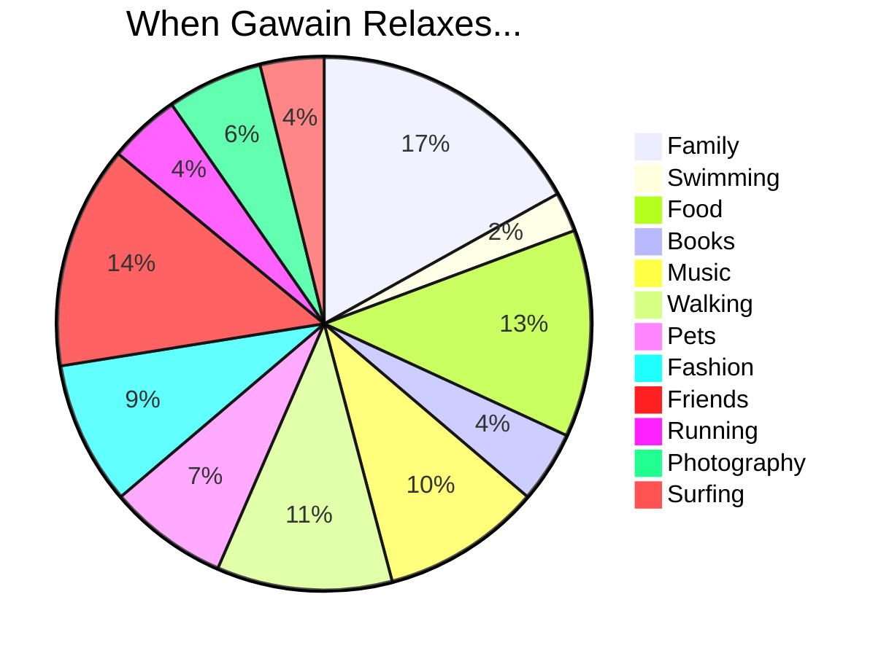

# [Gawain Hewitt](https://gawainhewitt.co.uk/)

London, UK • linkedin.com/in/gawainhewitt • 07817 317728 • gawain@gawainhewitt.co.uk  

[About me](#about_me) | [Things I am Proud Of](#proud) | [Tech stack](#tech-stack) | [Non Tech Stack](#non-tech-stack) | [Projects](#projects) | [Bootcamp!](#bootcamp) | [Skills](#skills) | [Experience](#experience) | [Interests](#interests) | [Education](#education)

## <a name="about_me">About me</a>

I am a self starting, self motivated, creative <b>full stack software developer</b> with a passion for inventing, making and building software, firmware and physical objects. I am father to three children, a keen cook and I love to wild swim and spend time in nature.

I have always worked in creative industrys, making music, art, sculptures, bespoke technology and running events. A lot of my career I have also worked in community and education projects, working with all age groups from preschool through to people living in care homes. The move into writing software has been a gradual process as my interests moved to making things that required custom firmware and software. As I explored writing it myself I found that I had a talent for it, and as I got better, a real love for the pace and possibilities of coding emerged.  

I would like to work for a company that is passionate about how technology can bring about change and make a difference. With my track record in delivering ambitious projects, and my recent skills from attending [Makers Academy](https://makers.tech/) I would bring my expertise in coding, my innovative and creative approach and my experience in leading teams and working with external stakeholders to add value to your team, create products that make a difference and ensure projects I am part of are succesfully completed. 

## <a name="proud">Things I am proud of</a>
* Brings 19 years of experience as a freelance creative working with communities, businesses, voluntary organisations and private clients, developing technologies and driving innovation in music and art
* Completed [Makers](https://makers.tech/) Software Development Bootcamp in 2022
* Developed software for interactive public music and art projects, [winning Spaced-Out Music Challenge](https://gawainhewitt.co.uk/technology#/tsdt) at MusicTech Festival 2018 in Stockholm for a device for the sonification of data (award sponsored by the Swedish National Space Agency and European Space Agency Hackathon)
* A pioneer of musical technology; developing [DMLab project](https://gawainhewitt.co.uk/technology#/accessible-musical-instruments) - bringing accessible instruments including guitar, musical gloves and conducting baton together with disabled musicians
* Lead artist for [Sound Young Minds](https://cityoflondonsinfonia.co.uk/wellbeing/wellbeing-projects/), a City of London Sinfonia project - winning [Royal Philharmonic Impact Award](https://cityoflondonsinfonia.wordpress.com/2020/11/19/city-of-london-sinfonia-wins-rps-impact-award-for-sound-young-minds/) in 2020, co-composing music with youth accessing mental health services
* Acted as director and licence holder for [Greenbelt Festival](https://www.greenbelt.org.uk/), managing stakeholder relationships and overseeing £2M festival budget

## <a name="tech-stack">My Tech Stack</a>

* JavaScript (React, Node.js, Express, MongoDB, Jest, Express)
* Ruby (Sinatra, RSpec, Capybara)
* SuperCollider
* Arduino (including C++)
* Applied use of microcontrollers including electonics and custom PCB design
* SQL (PostgreSQL, TablePlus)
* HTML, CSS (Bootstrap)
* Heroku, Netlify
* Git, GitHub 

## <a name="non-tech-stack">Non Tech stack</a>

* Sound Technology (SuperCollider, Pure Data, Max MSP)
* Custom electronics
* Business Strategy & Budgeting 
* Community Engagement
* Project Management
* Team Leadership

## <a name="projects">Pick of my projects</a>

| Name                         | Description       | Tech/tools        |
| ---------------------------- | ----------------- | ----------------- |
| [Trybe](https://github.com/lukestorey95/trybe-prod)| A cross platform app to build and manage a community in the supporting of achieving goals | Expo, React Native, JavaScript, Django REST Framework, Python |
| [Reflections](https://github.com/gawainhewitt/reflections)| An [interactive online sound installation](https://www.wigmoreinteractive.com/) for [Wigmore Hall](https://wigmore-hall.org.uk/) | JavaScript |
| [Sonic Minds](https://github.com/gawainhewitt/brain) | An interactive sound installation for [Lewisham Music](https://www.lewishammusic.org/), cast in pewter, it triggers sounds when touched | Arduino, Teensy, C++, Custom electronics |
| [TSDT](https://tsdthingy.github.io/) | Touchy Spacey Data Thingy is a device for the sonification of data. Created at the [Music Tech Fest](https://mtflabs.net/) hackathon in 2018, it won the Spaced Out Music Prize | C++, Arduino, Python, Max MSP |

## <a name="bootcamp">Bootcamp!</a>
<b>[Makers Academy](https://makers.tech/)</b> | Software Development Bootcamp	2022

## <a name="skills">What you get when you hire a Gawain</a>

### Technology and Software:

* As the lead for the [DMLab](https://www.drakemusic.org/technology/dmlab-community/) project at [Drake Music](https://www.drakemusic.org/), I ran an experimental programme to prototype accessible instruments for disabled musicians, pioneering the use of accessible musical technology and coordinating technologists, musicians and designers to create ground-breaking instruments. 
* Concieved, built and led [multiple public and private art projects](https://gawainhewitt.co.uk/creative) using Arduino, Teensy, C++, JavaScript, Tone.js and p5.js. Managed client relationships, budget, timings and delivery. 

### Innovation and Collaboration: 

* In working with renowned Norwegian percussionist [Terje Isungset](https://www.terjeisungset.no/), I created a series of recordings and performances using a hydrophone beneath an ice sheet. These pieces were then performed alongside some of Norway’s finest musicians at a headline performance at the [Ice Music Festival](https://www.icemusicfestivalnorway.no/) in Norway. 

### Organisational Leadership:

* By supporting the Board of Trustees of the [Greenbelt Festival](https://www.greenbelt.org.uk/) as an external consultant and licence holder, I directed the organisation of the festival in 2010, leading the senior management team and managing a budget of £2 million in addition to handling media engagements to promote the event. 

### Clear communication and mentoring

* Leading diverse teams of musicians from complete beginners through to professionals in the creation of spontaneously composed music. In holding this space able to get the best out of all and lead to [award winning](https://cityoflondonsinfonia.wordpress.com/2020/11/19/city-of-london-sinfonia-wins-rps-impact-award-for-sound-young-minds/) music being created where all voices are heard and valued. 
* As spokesperson for several large arts projects I have given talks at events all over the world on the subject of creativity, inclusion and technology. Examples include [Music Tech Fest](https://mtflabs.net/), [New Instruments For Musical Expression](https://www.nime.org/) and the [Royal Academy of Music](https://www.ram.ac.uk/). 

## <a name="experience">PROFESSIONAL EXPERIENCE</a>
<b>Gawain Hewitt Ltd</b> • London  
Owner	2003 – Present  
Harnesses technology to lead musicians in composing original music for a variety of commercial and community projects in addition to creating original music in collaboration with other artists as embedded support or an external consultant. Created and delivered successful art installations in prominent locations utilising expertise in writing code in C++, SuperCollider and JavaScript to support one-off art and music projects. 

### Sound Coding & Engineering
* Utilised skills as a hacker and maker to [code and construct](https://gawainhewitt.co.uk/technology) installations using platforms such as Pure Data, Raspberry Pi and Arduino that were featured at famous international locations
* Acted as recording engineer and technician on projects for artists including [TY](https://mixmag.net/feature/ty-and-the-history-of-uk-rap), [Amp Fiddler](http://www.ampfiddler.com/), [Cibelle](https://www.sixdegreesrecords.com/cibelle/) and award-winning ‘photograffeur’ [JR](https://www.jr-art.net/).
* Awarded platinum disk as recognition for contribution to double-MOBO award-winning album Uncle B by [N Dubz](https://en.wikipedia.org/wiki/N-Dubz)
* Secured funding from [Arts Council England](https://www.artscouncil.org.uk/) to tour live improvisations of electronic music, performing with other artists to showcase music, technology and sound working together
* Built in-house studio for Sony Gold award-winning radio production company [Folded Wing](https://www.foldedwing.co.uk/) for use in national and international music projects
* Contributed composition for soprano, recorder and oboe to accompany [Heather B Swann’s](https://en.wikipedia.org/wiki/Heather_B._Swann) solo exhibition The Long Rock in Australia
* Collaborated with renowned Norwegian musicians to employ code and hydrophones to test performance on a frozen fjord at Norway’s [Ice Music Festival](https://www.icemusicfestivalnorway.no/) in 2016

### Technology
* Designed and created of [interactive room](https://gawainhewitt.co.uk/creative#/home-from-home) at [Wigmore Hall](https://wigmore-hall.org.uk/), allowing the composition of music to be altered in real time by placing objects on special sensors
* Won [Giant Steps and Soundcloud IOT prize](https://youtu.be/FnPf6xO0uuQ?t=908) at Berlin’s Music TechFest 2016 for wood-based mechanical sound sculpture designed in collaboration with other artists
* Collaborated with Imogen Heap to develop [Mi Mu Gloves](https://mimugloves.com/) as one of 15 global artists
### Art Exhibitions
* Exhibited 3 pieces as sole artist at [3-month exhibition](https://bethlemgallery.com/whats-on/in-this-moment/) at Bethlam Art Gallery at Bethlem Hospital
* Commissioned by City of London Festival to create interactive sound installation ‘Forest of London’, collaborating with a photographer to deliver an experience that was on display 24 hours a day for 5 weeks
* Created light and sound installation for performance at Royal Albert Hall as part of Music for Youth Proms in 2014, leading orchestral technology section and helping young contributors compose work
* Commissioned to create interactive sound and photographic piece at Spitalfields Winter Festival
* Contributed works to [Tate Lates](https://gawainhewitt.co.uk/creative#/tate-lates) exhibitions at Tate Modern on 2 occasions
* Produced two permanent installations for St Mary’s and Royal Brompton Children’s Hospitals
### Music Education & Composition
* Designed and delivered weekly music education courses for Pupil Referral Units in London, creating current and relevant music with marginalised young people
* Engaged music technology to deliver musical installation over 3 months on estate in Brixton
* Created a [musical brain](https://gawainhewitt.co.uk/creative#/sonic-minds) sculpture to advocate on behalf of young people accessing mental health services in South London
* Composed musical pieces with disabled musicians that have been shared at renowned venues such as the Royal Festival Hall
* Long-serving supporter of Community Music, a community initiative funded by the Arts Council, facilitating youth music and training through courses and performances

## EARLY CAREER 
<b>Medical Research Council</b> • London 
Facilities Coordinator	2001 – 2003 
<b>Hammersmith & Fulham Council</b> • London 
Office Restructuring Team Project Coordinator	2001 – 2001 
<b>Petplan Insurance</b> • London 
Customer Service Team Leader	1998 – 2001 
<b>Potterton </b>• London 
Customer Service Advisor	1997 – 1998

## <a name="interests">When I'm not coding (Interests)</a>

## <a name="education">EDUCATION</a>
<b>Royal Welsh College of Music & Drama</b> • Cardiff, UK  
Master of Music in Creative Music Technology	2017 
<b>Community Music and London Metropolitan University </b> • London, UK  
Music Tutor Training Course	2004
